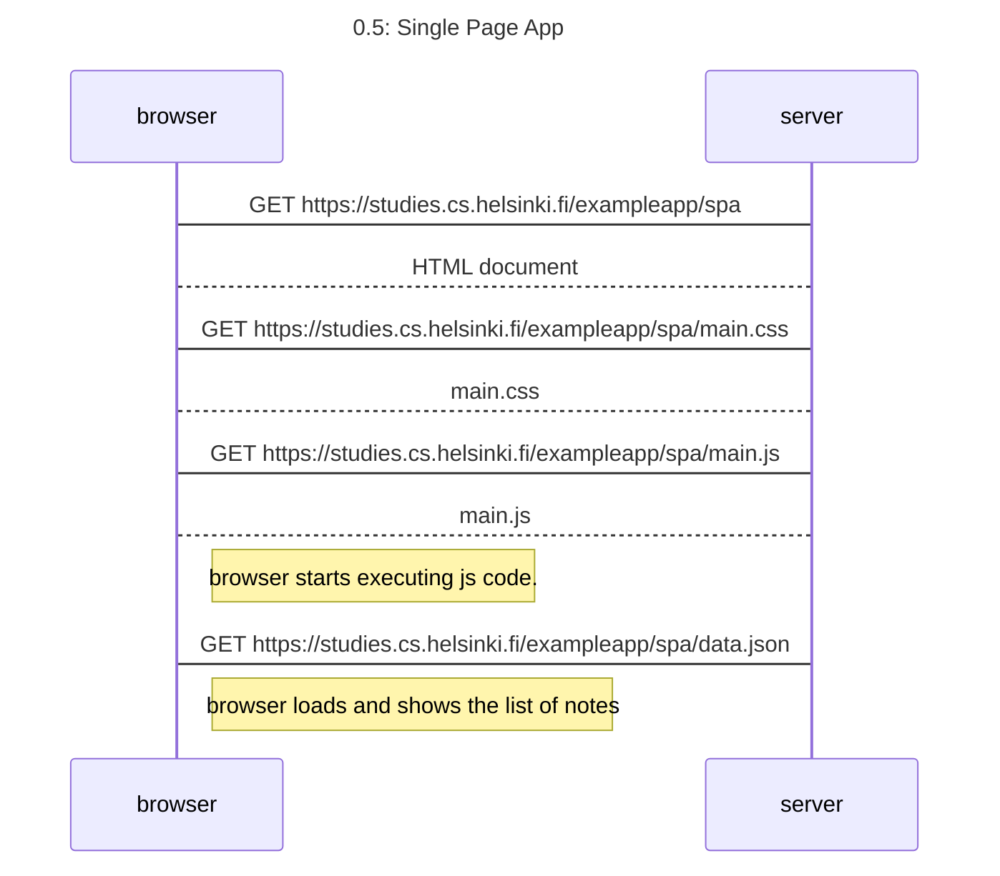

```mermaid
sequenceDiagram
Title: 0.5: Single Page App

    browser->server: GET https://studies.cs.helsinki.fi/exampleapp/spa
    server-->browser: HTML document
    browser->server: GET https://studies.cs.helsinki.fi/exampleapp/spa/main.css
    server-->browser: main.css
    browser->server: GET https://studies.cs.helsinki.fi/exampleapp/spa/main.js
    server-->browser: main.js

    note right of browser: browser starts executing js code.

    browser->server: GET https://studies.cs.helsinki.fi/exampleapp/spa/data.json

    note right of browser: browser loads and shows the list of notes
```
