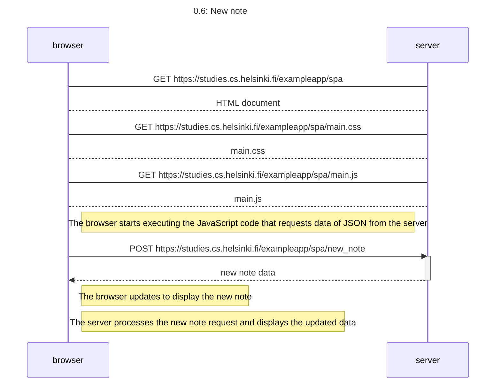

```mermaid
sequenceDiagram
    Title: 0.6: New note

    browser->server: GET https://studies.cs.helsinki.fi/exampleapp/spa
    server-->browser: HTML document
    browser->server: GET https://studies.cs.helsinki.fi/exampleapp/spa/main.css
    server-->browser: main.css
    browser->server: GET https://studies.cs.helsinki.fi/exampleapp/spa/main.js
    server-->browser: main.js

Note right of browser: The browser starts executing the JavaScript code that requests data of JSON from the server
    
    browser->>server: POST https://studies.cs.helsinki.fi/exampleapp/spa/new_note
    activate server
    server-->>browser: new note data
    deactivate server    

    Note right of browser: The browser updates to display the new note
    Note right of browser: The server processes the new note request and displays the updated data
```
